Оценка 3
просмотрела статус
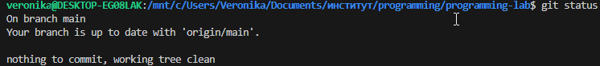
Смотрю историю комитов
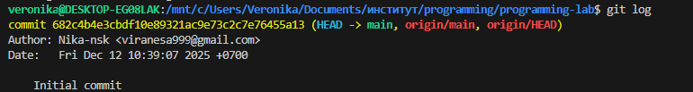
Указываю файл который буду сохранять(комитить)
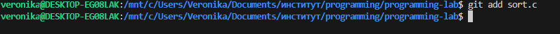
Снова проверяю статус
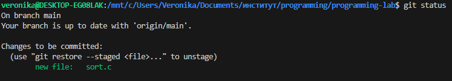
Закомитила
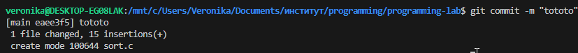
Снова проверила статус
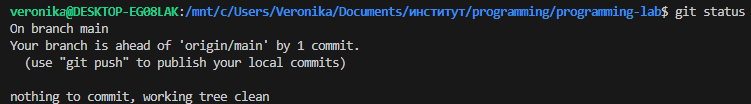
Пишу комментарий в файл
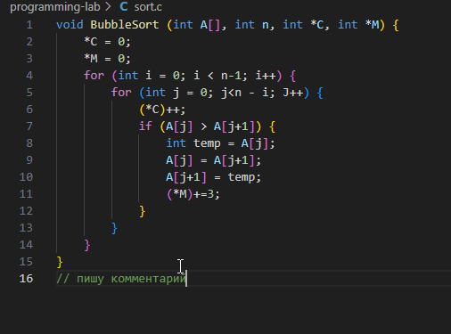
Статус
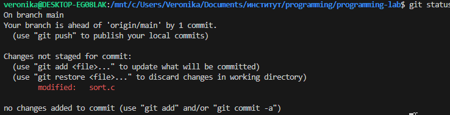
Указываю файл
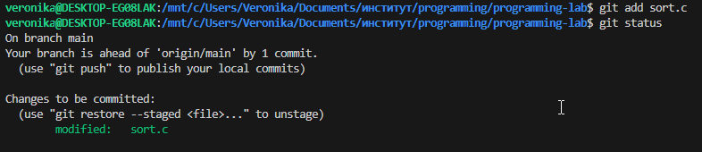
Статус
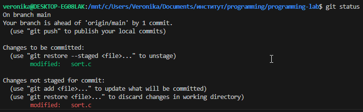
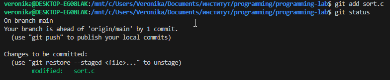
закомитила
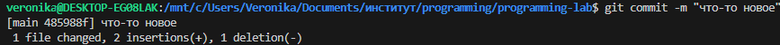
запушила
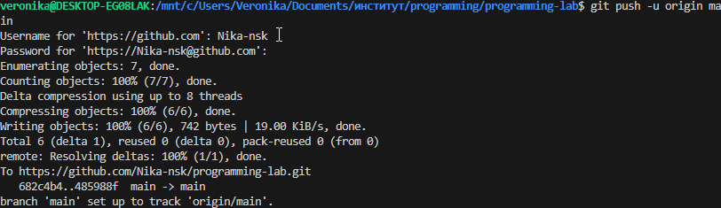
Создаю ветки, хожу месту ними
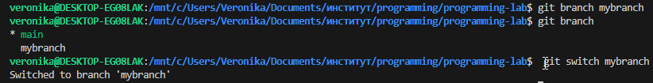
Статус
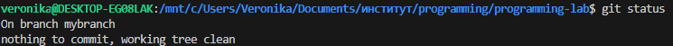
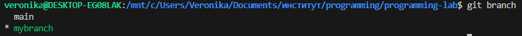
Комичу(появились новые файлы)
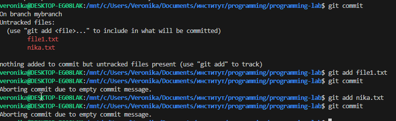
Дала имя, закомитила, создала новую ветку, перешла на нее
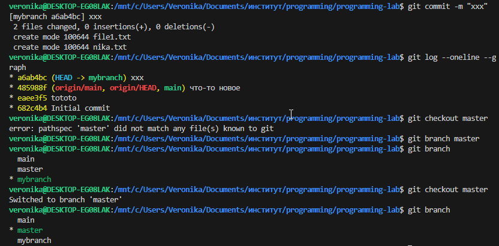
Указала файл и закомитила
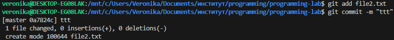
