На оценку "3"
Создала программу в которой потоки выводятся с помощью pthread_create(). Вывожу родительский и дочерний поток по 5 строк текста. 
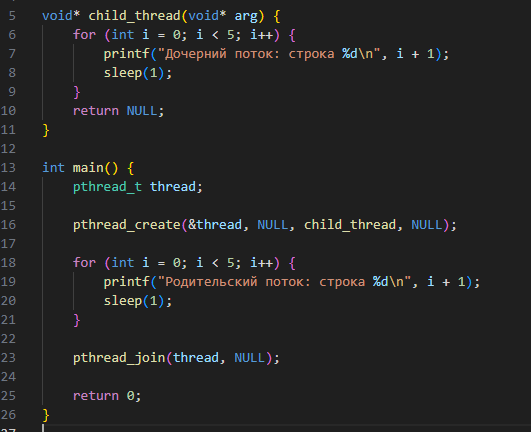

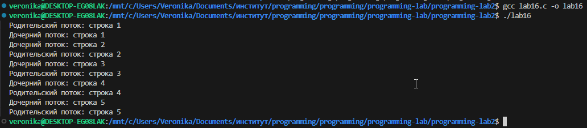
Выполняю 1 и 2 пункты задания. Дочерний поток выводится после родительского. Использую pthread_join(), чтобы главный поток не закрыл программу раньше времени и подождал, пока дочерний поток доделает свою работу.
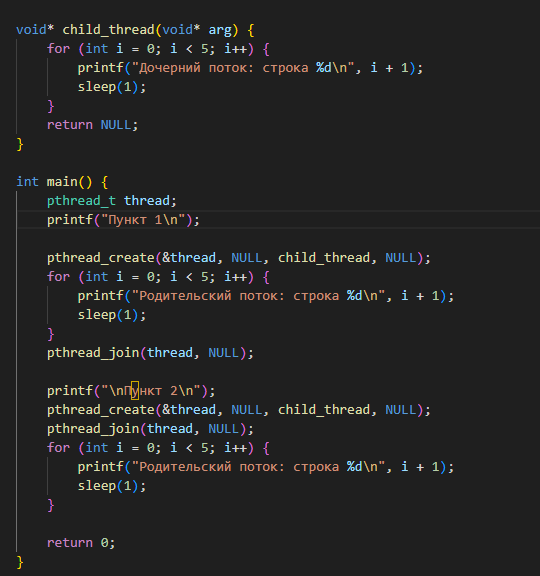

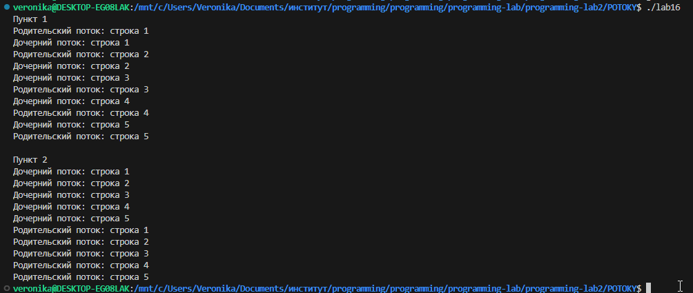
В код добавила массив из четырех потоков и четыре разных набора строк. При создании каждого потока эти строки передаются ему как уникальный параметр для вывода на экран.
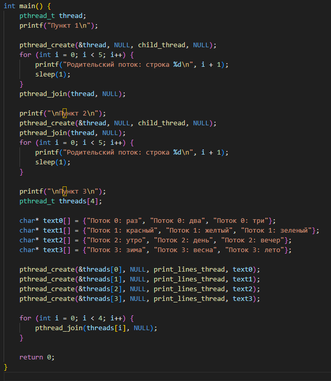
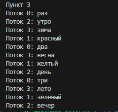

В Пункте 4 главный поток засыпает на 2 секунды сразу после запуска четырех дочерних потоков. За это время они успевают напечатать только часть своих строк, после чего главный поток принудительно завершает их работу функцией pthread_cancel()
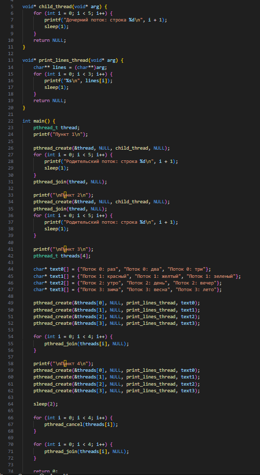
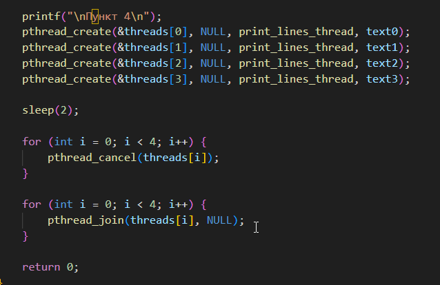
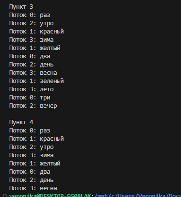

 Использовала функцию pthread_cleanup_push(). При прерывании потока через pthread_cancel этот обработчик автоматически выполняется и выводит сообщение о том, какой именно поток закрылся.
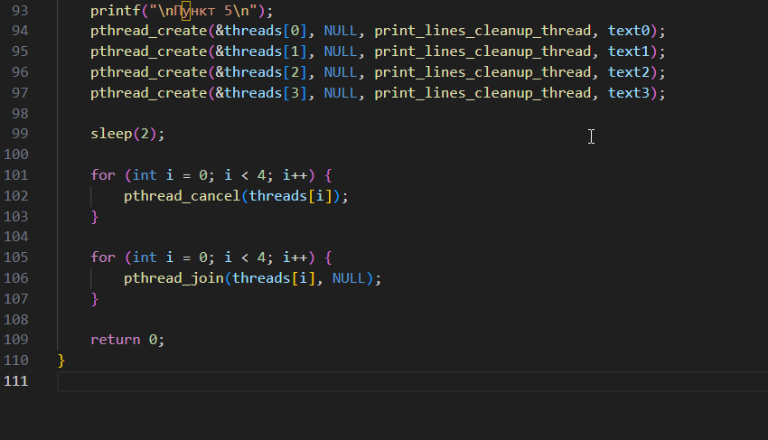
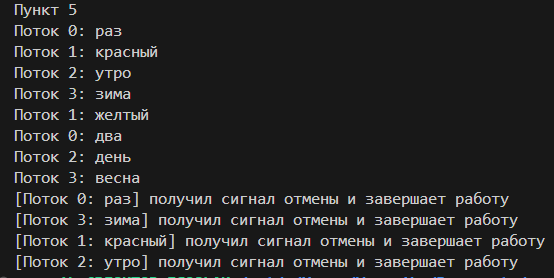
Реализовала алгоритм Sleepsort. Для каждого числа из массива создается отдельный поток, который засыпает на время, пропорциональное значению этого числа, а затем выводит его, формируя отсортированный по возрастанию массив.
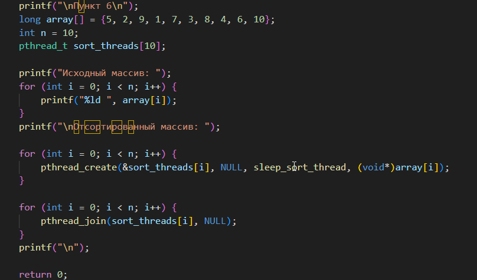
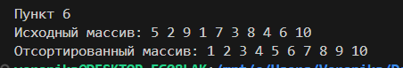

На оценку "4"

В Пункте 7 я добавила мьютекс, условную переменную и флаг очередности turn. Родительский и дочерний потоки блокируют друг друга и по очереди меняют значение флага, чтобы строки выводились строго одна за другой.
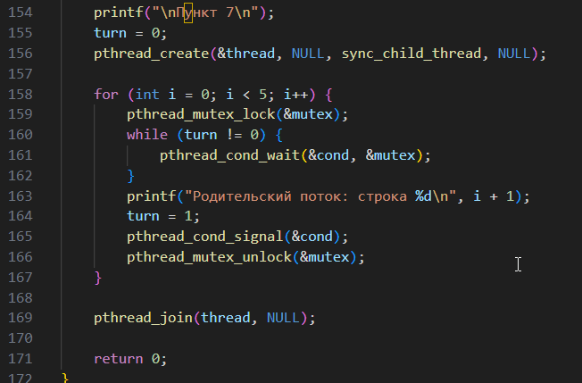
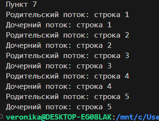

В Пункте 8 реализовала параллельное умножение двух матриц, заполненных единицами. Главный поток делит строки матрицы на равные части между заданным количеством потоков, каждый из которых независимо вычисляет свою порцию строк и записывает результат в общую матрицу.

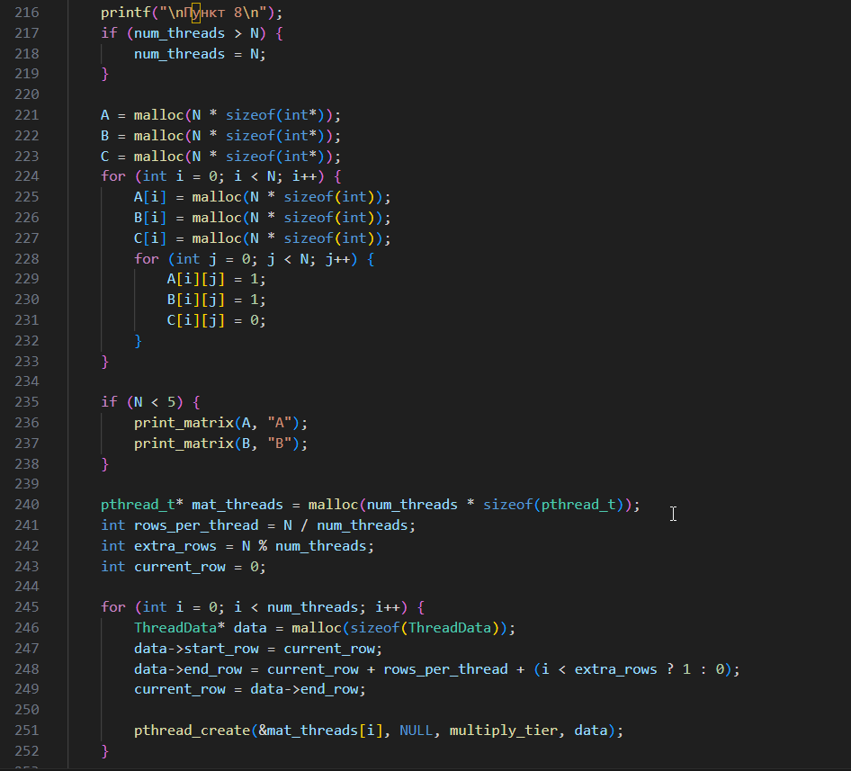

Сделали замеры для графика.

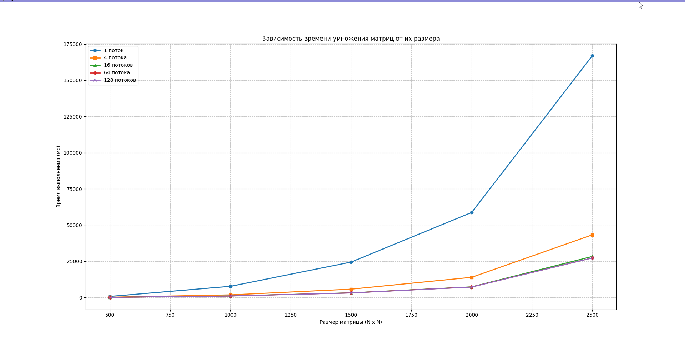